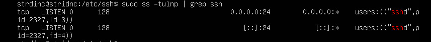
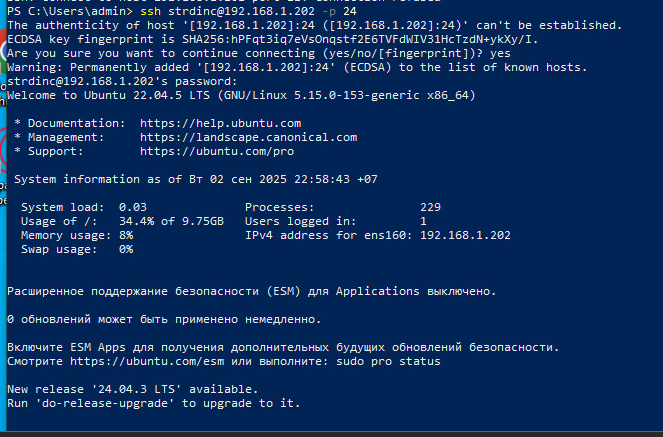
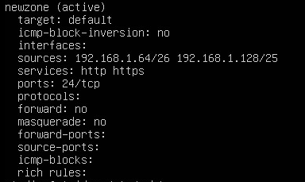

# Проверка и натсройка времени

````
timedatectl status
sudo timedatectl set-timezone Asia/Novosibirsk
sudo timedatectl set-ntp true
````

# Проверка обновлений

````
sudo apt update && sudo apt upgrade -y
````

# Установка необходимых программ

````
sudo apt install -y vim htop net-tools curl wget git unzip firewalld ufw
````

# SELinux выключен

# Настройка SSH
## Запрет root и изменение порта
````
sudo nano /etc/ssh/sshd_config
````
- PermitRootLogin no
- Port 24

````
sudo systemctl restart ssh
````
## Проверка порта
````
sudo apt install net-tools
sudo netstat -tulnp | grep ssh
````



## Настройка firewall
````
sudo firewall-cmd --permanent --add-port=24/tcp
sudo firewall-cmd --reload
sudo systemctl restart ssh
````


## firewalld
````
sudo systemctl enable --now firewalld
sudo firewall-cmd --permanent --new-zone=newzone
sudo firewall-cmd --permanent --zone=newzone --add-source=192.168.1.64/26
sudo firewall-cmd --permanent --zone=newzone --add-source=192.168.1.128/25
sudo firewall-cmd --permanent --zone=newzone --add-port=2222/tcp
sudo firewall-cmd --permanent --zone=newzone --add-service=http
sudo firewall-cmd --permanent --zone=newzone --add-service=https
sudo firewall-cmd --reload
sudo firewall-cmd --zone=newzone --list-all
````

