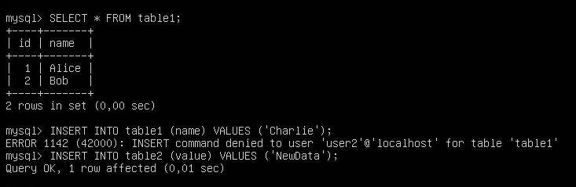

# Установка и настройка MySQL 
````
sudo apt install mysql-server -y

# Добавление в автозагрузку
sudo systemctl enable mysql

# Запуск скрипта безопасности
sudo mysql_secure_installation
````

# Создание базы данных (sql)
````
CREATE DATABASE test_bd CHARACTER SET utf8mb4 COLLATE utf8mb4_unicode_ci;
SHOW DATABASES;
````

# Создание пользователя (sql)
````
CREATE USER 'user'@'localhost' IDENTIFIED BY 'Pa$$w0rd';
GRANT ALL PRIVILEGES ON test_bd.* TO 'user'@'localhost';
FLUSH PRIVILEGES;
````

# Работа от user
## bash
````
mysql -u user -p test_bd
````
## sql
````
CREATE TABLE table1 (id INT AUTO_INCREMENT PRIMARY KEY, name VARCHAR(50));
CREATE TABLE table2 (id INT AUTO_INCREMENT PRIMARY KEY, value VARCHAR(50));

INSERT INTO table1 (name) VALUES ('Alice'), ('Bob');
INSERT INTO table2 (value) VALUES ('Test1'), ('Test2');

SELECT * FROM table1;
SELECT * FROM table2;
````

# Создание user2 и работа
## bash
````
mysql -u root -p
````
## sql
````
CREATE USER 'user2'@'localhost' IDENTIFIED BY 'Pa$$w0rd';

-- Таблица 1: только SELECT
GRANT SELECT ON test_bd.table1 TO 'user2'@'localhost';

-- Таблица 2: SELECT, INSERT, DELETE
GRANT SELECT, INSERT, DELETE ON test_bd.table2 TO 'user2'@'localhost';

FLUSH PRIVILEGES;
````
### Проверка
#### bash
````
mysql -u user2 -p test_bd
````
#### sql
````
SELECT * FROM table1;
INSERT INTO table1 (name) VALUES ('Charlie');
INSERT INTO table2 (value) VALUES ('NewData');
````


# Скрипт для бэкапов и cron

### Скрипт /usr/local/bin/mysql_backup.sh
````
#!/bin/bash
BACKUP_DIR="/backup"
DATE=$(date +"%Y-%m-%d_%H-%M-%S")
mkdir -p $BACKUP_DIR
mysqldump --all-databases > $BACKUP_DIR/all_db_$DATE.sql
````

````
sudo chmod +x /usr/local/bin/mysql_backup.sh
sudo crontab -e
# Добавить строку [0 2 * * * /usr/local/bin/mysql_backup.sh]
````

# Firewalld
ip адреса 192.168.1.64-192.168.1.254 задействованы в лабораторной 1
````
sudo firewall-cmd --permanent --zone=mysqlzone --add-port=3306/tcp
````
# Разрешение удалённых подключений
````
sudo nano /etc/mysql/mysql.conf.d/mysqld.cnf
# bind-address = 0.0.0.0
sudo systemctl restart mysql
````
